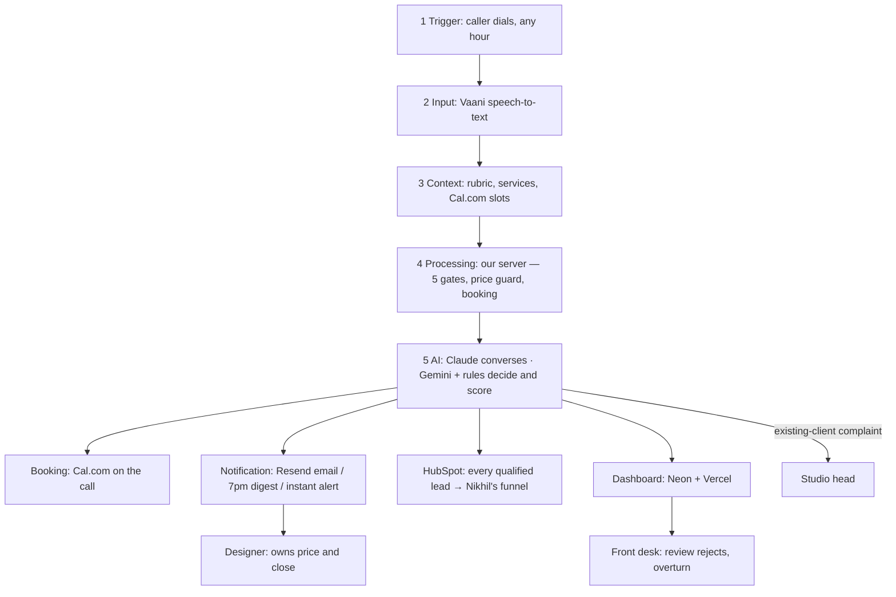

# Components Map — Aangan Studio phone agent

Updated with the class guardrails (see `docs/nine-checks.md`). North star: **more booked consultations and won projects (revenue)**, not just faster answers.

## Trigger → Input → Context → Processing → AI → Output

| Stage | What it is | Tool |
|---|---|---|
| 1 · Trigger | Caller dials the studio number, any hour. The number forwards to the agent | Vaani (app.vaanivoice.ai) telephony |
| 2 · Input | Caller's live speech → text; caller number; time of call | Vaani speech-to-text |
| 3 · Context | Nikhil's rubric (`qualified.md`), `services.md`, the pricing *deflection line only*, live open slots | Files in `context/` · Cal.com API |
| 4 · Processing | Our server handles every turn (Vaani BYOL): runs the 5 gates, the **price guard** before anything is spoken, books the slot | Python bridge (`voice_server/`) + backend on Vercel |
| 5 · AI | Claude runs the conversation and books on the call. After the call, Gemini Flash extracts the facts with verbatim quotes, and plain code decides: Qualified P1/P2 · Nurture · Not qualified + reason · Escalate, score /100 | Claude · Gemini Flash · `qualify/rules.py` |
| 6 · Output | Four outputs (below) | Cal.com · Resend · HubSpot · Neon + Vercel dashboard |

## The four outputs

| Output | For whom | What |
|---|---|---|
| **Booking on the call** | Caller + designer | Cal.com slot booked live; Cal.com sends the confirmation and calendar invite. No "the designer will get back to you" |
| **Notification** | Designer (owner) · studio head · designers' digest | Resend email: report card with summary, slot and link to the caller's dashboard page. Instant complaint alert to studio head. 7pm digest of everything not booked |
| **HubSpot** | Nikhil | Every **qualified** lead becomes a contact + deal (booked → "Appointment Scheduled", not yet booked → "Qualified To Buy"). Amount left empty; the designer adds it after quoting, so won revenue shows in the funnel |
| **Dashboard** | Front desk + designers (+ Nikhil's overview) | Neon call log on Vercel: every enquiry with transcript, recording, details, score and reason; **review queue for rejected and Nurture leads with an overturn button**; overview of bookings, conversion, revenue vs running cost |

## Human layer (guardrails)

| Who | Checkpoint | Risk it covers |
|---|---|---|
| Front desk | Reviews rejected/Nurture leads (dashboard + 7pm digest), overturns, calls back `booking_pending` | Good lead rejected (false negative — the costlier error) |
| Designer (owner) | Gives the price at the consultation; marks the deal won/lost; ticks "had to re-ask" | Wrong price; wrong info handed over |
| Studio head | Instant alert for existing-client complaints | Complaint mishandled by AI |
| Aastha + Nikhil | Monthly review of overturns, price-askers' conversion, qualified→won | Rubric drift; the first build is never the final build |

Pictures of the earlier version: `component-map.svg`, `post-booking-flow.svg`.
